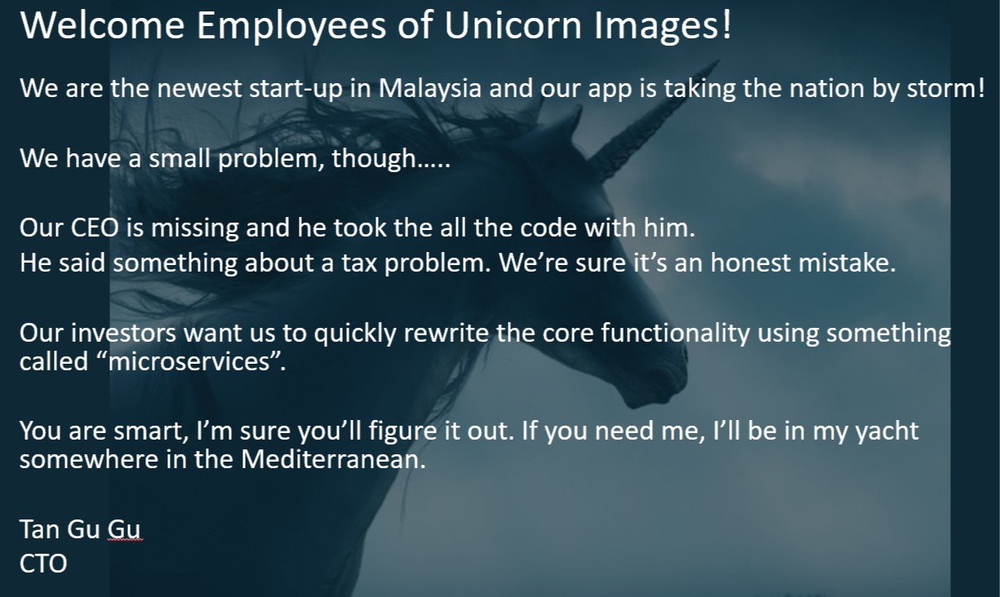

 

# TestAPI

A short description of the project

## Requirements

* [AWS CLI](https://aws.amazon.com/cli/) already configured with PowerUser permission
* [AWS SAM CLI](https://github.com/awslabs/aws-sam-local) installed
* [.NET Core 2.1](https://www.microsoft.com/net/download/) installed. Please review the [Currently Supported Patch](https://github.com/aws/aws-lambda-dotnet#version-status) for your project type.
* [Docker](https://www.docker.com/community-edition) installed


## Recommended Tools for Visual Studio / Visual Studio Code Users

* [AWS Toolkit for Visual Studio](https://aws.amazon.com/visualstudio/)
* [AWS Extensions for .NET CLI](https://github.com/aws/aws-extensions-for-dotnet-cli) which are AWS extensions to the .NET CLI focused on building .NET Core and ASP.NET Core applications and deploying them to AWS services including Amazon Elastic Container Service, AWS Elastic Beanstalk and AWS Lambda.

> Note: this project uses Cake Build for build, test and packaging requirements. You do not need to have the [AWS Extensions for .NET CLI](https://github.com/aws/aws-extensions-for-dotnet-cli) installed, but are free to do so if you which to use them. Version 3 of the Amazon.Lambda.Tools does require .NET Core 2.1 for installation, but can be used to deploy older versions of .NET Core.

* [Cake Build](https://cakebuild.net/docs/editors/) Editor support for Visual Studio Code and Visual Studio.

## Other resources

* Please see the [Learning Reasources](https://github.com/aws/aws-lambda-dotnet#learning-resources) section on the AWS Lambda for .NET Core GitHub repository.
* [The official AWS X-Ray SDK for .NET](https://github.com/aws/aws-xray-sdk-dotnet)

## Build, Packaging, and Deployment
This solution comes with a pre-configured [Cake](https://cakebuild.net/)  (C# Make) Build script which provides a cross-platform build automation system with a C# DSL for tasks such as compiling code, copying files and folders, running unit tests, compressing files and building NuGet packages.

The build.cake script has been set up to:

* Build your solution projects
* Run your test projects
* Package your functions
* Run your API in SAM Local.

To execute a build use the following commands:

### Linux & macOS

```bash
sh build.sh --target=Package
```

### Windows (Powershell)

```powershell
build.ps1 --target=Package
```

To package additional projects / functions add them to the build.cake script "project section".

```csharp
var projects = new []
{
    sourceDir.Path + "TestAPI/TestAPI.csproj",
    sourceDir.Path + "{PROJECT_DIR}/{PROJECT_NAME}.csproj"
};
```

AWS Lambda C# runtime requires a flat folder with all dependencies including the application. SAM will use `CodeUri` property to know where to look up for both application and dependencies:

```yaml
...
    Unicorn ImagesFunction:
        Type: AWS::Serverless::Function
        Properties:
            CodeUri: ./artifacts/Unicorn Images.zip
            ...
```

### Deployment

First and foremost, we need an `S3 bucket` where we can upload our Lambda functions packaged as ZIP before we deploy anything - If you don't have a S3 bucket to store code artifacts then this is a good time to create one:

```bash
aws s3 mb s3://BUCKET_NAME
```

Next, run the following command to package our Lambda function to S3:

```bash
sam package \
    --template-file template.yaml \
    --output-template-file packaged.yaml \
    --s3-bucket REPLACE_THIS_WITH_YOUR_S3_BUCKET_NAME
```

Next, the following command will create a Cloudformation Stack and deploy your SAM resources.

```bash
sam deploy \
    --template-file packaged.yaml \
    --stack-name unicorn-images \
    --capabilities CAPABILITY_IAM
```

> **See [Serverless Application Model (SAM) HOWTO Guide](https://github.com/awslabs/serverless-application-model/blob/master/HOWTO.md) for more details in how to get started.**


After deployment is complete you can run the following command to retrieve the API Gateway Endpoint URL:

```bash
aws cloudformation describe-stacks \
    --stack-name unicorn-images \
    --query 'Stacks[].Outputs'
``` 


## Testing

For testing our code, we use XUnit and you can use `dotnet test` to run tests defined under `test/`

```bash
dotnet test Unicorn Images.Test
```

Alternatively, you can use Cake. It discovers and executes all the tests.

### Linux & macOS

```bash
sh build.sh --target=Test
```

### Windows (Powershell)

```powershell
build.ps1 --target=Test
```

### Local development

Given that you followed Packaging instructions then run the following to invoke your function locally:


**Invoking function locally through local API Gateway**

```bash
sam local start-api
```

**SAM Local** is used to emulate both Lambda and API Gateway locally and uses our `template.yaml` to understand how to bootstrap this environment (runtime, where the source code is, etc.) - The following excerpt is what the CLI will read in order to initialize an API and its routes:

```yaml
...
Events:
    sam-app:
        Type: Api # More info about API Event Source: https://github.com/awslabs/serverless-application-model/blob/master/versions/2016-10-31.md#api
        Properties:
            Path: /hello
            Method: get
```

If the previous command run successfully you should now be able to hit the following local endpoint to invoke your function `http://localhost:3000/REPLACE-ME-WITH-ANYTHING`.


# Appendix

## AWS CLI commands

AWS CLI commands to package, deploy and describe outputs defined within the cloudformation stack:

```bash
aws cloudformation package \
    --template-file template.yaml \
    --output-template-file packaged.yaml \
    --s3-bucket REPLACE_THIS_WITH_YOUR_S3_BUCKET_NAME

aws cloudformation deploy \
    --template-file packaged.yaml \
    --stack-name unicorn-images \
    --capabilities CAPABILITY_IAM \
    --parameter-overrides MyParameterSample=MySampleValue

aws cloudformation describe-stacks \
    --stack-name unicorn-images --query 'Stacks[].Outputs'
```

## Bringing to the next level

Here are a few ideas that you can use to get more acquainted as to how this overall process works:

* Create an additional API resource (e.g. /hello/{proxy+}) and return the name requested through this new path
* Update unit test to capture that
* Package & Deploy

Next, you can use the following resources to know more about beyond hello world samples and how others structure their Serverless applications:

* [AWS Serverless Application Repository](https://aws.amazon.com/serverless/serverlessrepo/)